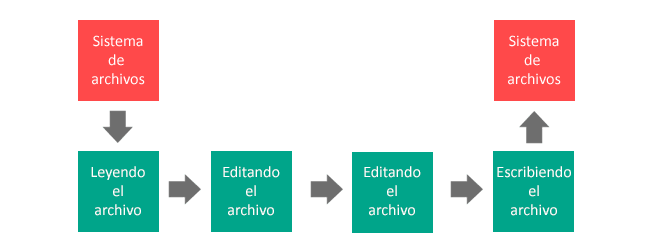

## GitBook

##  ¿Qué es?

Gitbook es una herramienta que permite crear libros y
documentos utilizando sintaxis Markdown o AsciiDoc. Estos
libros una vez creados, pueden ser visualizados en web, o
pueden ser exportados como e-book o pdf.


Aparte, esta herramienta ofrece una especie de plataforma
web que, tras identificarnos nos permite publicar los
libros de forma gratuita para que cualquier persona pueda
visualizarlo. Esta característica nos ofrece funciones
adicionales como la posibilidad de escribir comentarios en
los párrafos del libro a cualquier persona previamente
registrada y que así lo desee.

## Utilización

***1. Creación de una cuenta en Gitbook***


Para crear una cuenta en Gitbook podemos dar nuestros datos para
la creación o asociarla con Github o alguna otra plataforma. Es interesante 
asociarla con Github para documentar proyectos ya que tendrás acceso a los
distintos repositorios de tu cuenta. Pudiendo documentar así el que más te pueda interesar.
    
***2. Creación de un libro***

Una vez dentro de la página tendremos la opción de crear nuestra documentación
para ello tendremos que elegir un título y un modo. Que podrá ser enlazando el
contenido con Github o dejarlo en Gitbook.


## Package.json


En este archivo, que debe estar en la raíz del proyecto, va a quedar reflejada la configuración del proyecto de Node tales como el nombre,el autor,las dependencias del 
proyecto que necesita el proyecto para funcionar.Las dependencias que se 
encuentren en el package.json son las que se instalaran una vez ejecutado
el comando: ```npm install```


## Gh-Pages
### ¿Qué son?
Se trata de una herramienta de Git hub que permite desplegar tu página web de manera sencilla. Simplemente creando una rama llamada "gh-pages" y empujando los archivos a ella.
### ¿Cómo se utilizan?
***1. Crear un archivo index***
    Dentro de github.com creamos un nuevo repositorio o vamos a uno ya existente. hacemos click en *Create a new file*. 

***2. Escribimos el contenido del archivo***
    Debemos llamar a dicho archivo *idex.html*. Escribimos codigo HTML en él.

***3. Escribimos el commit del archivo***
    Bajamos hasta la parte baja de la pagina, escribimos un mensaje de commit y hacemos click en *Commit new file*.

***4. Configuración del repositorio***
    En la pestaña *Settings* vamos a la sección GitHub Pages, seleccionamos la rama master como fuente y guardamos.

***5. Y hemos acabado***
    Si escribimos en un navegador la dirección *http://nombredeusuario.github.io/repositorio* tendremos la pagina web de nuestro proyecto.
  
  
  
##Despliegue en Gitbook  
  
  
  
  
    
## NodeJS
### ¿Qué es?
Node es un intérprete Javascript del lado del servidor que cambia la noción de cómo debería trabajar un servidor. Su meta es permitir a un programador construir aplicaciones altamente escalables y escribir código que maneje decenas de miles de conexiones simultáneas en una sólo una máquina física.

### npm
Es el manejdor por defecto para Node.js, un entorno de ejecucion para JavaScript. Se ejecuta desde la linea de comandos y maneja las dependencias para una aplicación, es el equivalente a gemspec de ruby.
Ademas permite a los usuarios instalar aplicaciones Node.js que se encuentran en el repositorio.

### Package.json

### Express

## ¿Qué es Gulp?
Es una herramienta que permite automatizar tareas comunes de desarrollo
    .Se suele utilizar para tareas de front-end como recargar la página
    ,optimizar activos como CSS, JavaScript,las imágenes y un sin fin de demás 
    tareas
    
    