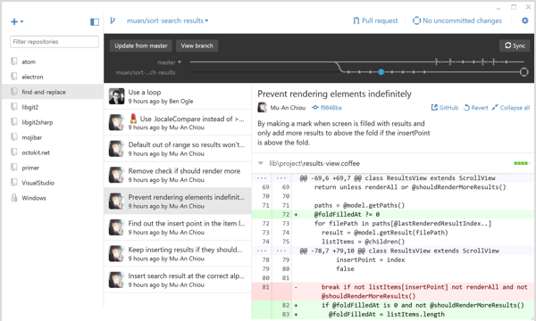
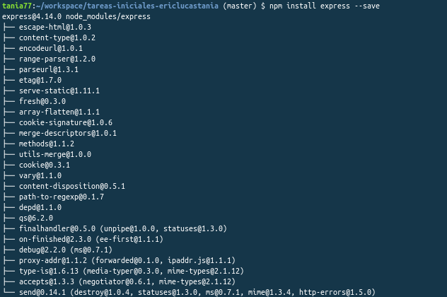

 

> #### primary::1. Gitbook 

> 

> ### ¿Qué es?  


> Gitbook es una herramienta que nos permite crear libros y
documentos utilizando sintaxis Markdown o AsciiDoc. Estos
libros una vez creados, pueden ser visualizados en web, o
pueden ser exportados como e-book o pdf.  https://www.youtube.com/watch?v=9bZkp7q19f0 

> Tiene una plataforma web donde una vez identificados se puede publicar libros de forma gratuita.


> ### Utilización

> ***1. Creación de una cuenta en Gitbook***


> Para crear una cuenta en Gitbook podemos dar nuestros datos para
la creación o asociarla con Github o alguna otra plataforma. Es interesante 
asociarla con Github para documentar proyectos ya que tendrás acceso a los
distintos repositorios de tu cuenta. Pudiendo documentar así el que más te pueda interesar.
    
> ***2. Creación de un libro***

> Una vez dentro de la página tendremos la opción de crear nuestra documentación
para ello tendremos que elegir un título y un modo. Que podrá ser enlazando el
contenido con Github o dejarlo en Gitbook.


> ### Markdown 

> Para el desarrollo de este documento se ha utilizado Markdown. Aquí las multiples opciones que ofrece este lenguaje.
>
    # Encabezado h1
    ## Encabezado h2
    ### Encabezado h3
    #### Encabezado h4
    ##### Encabezado h5
    ###### Encabezado h6
    Citas: Para citar solo es necesario escribir una cuña antes del texto
>
    La vida es muy corta para aprender Alemán. -Tad Marburg
    Texto con énfasis: Agregar un asterisco para cursiva y dos para negrita
>
     *énfasis* (cursiva)
>
     **énfasis fuerte** (negrita)
    Código: Se utiliza el acento grave para identificar código
>
     `Código`
     ```
     Código en
     varias líneas
     ```
    Listas:
>
     * Un elemento en una lista no ordenada
     * Otro elemento en una lista
     1. Elemento en una lista enumerada u ordenada.
     2. Otro elemento
    Enlaces:
>
     [Texto del enlace aquí](URL "Título del enlace")

----------

> #### warning:: 2. Github Desktop  
> 
### Instalación

> Para instalar Github APP en windows se ha accedido a la [página oficial ](https://desktop.github.com/) e se instaló la version de desktop que nos permite trabajar con una interfaz


> Una vez instalado el mismo podremos trabajar con los respositorios vinculados a nuestra cuenta de GitHub, así como crear, clonar los mismos y trabajar con múltiples ramas mediante una interfaz gráfica.


> 


----------


> #### danger:: 3. Gh-Pages 
> 
> ### ¿Qué son?

> Se trata de una herramienta de Git hub que permite desplegar tu página web de manera sencilla. Simplemente creando una rama llamada "gh-pages" y empujando los archivos a ella.
> ### ¿Cómo se utilizan?
> ***1. Crear un archivo index***
    Dentro de github.com creamos un nuevo repositorio o vamos a uno ya existente. hacemos click en *Create a new file*. 

> ***2. Escribimos el contenido del archivo***
    Debemos llamar a dicho archivo *idex.html*. Escribimos codigo HTML en él.

> ***3. Escribimos el commit del archivo***
    Bajamos hasta la parte baja de la pagina, escribimos un mensaje de commit y hacemos click en *Commit new file*.

> ***4. Configuración del repositorio***
    En la pestaña *Settings* vamos a la sección GitHub Pages, seleccionamos la rama master como fuente y guardamos.

> ***5. Y hemos acabado***
    Si escribimos en un navegador la dirección *http://nombredeusuario.github.io/repositorio* tendremos la pagina web de nuestro proyecto.
  
----------


> #### success:: 4. Despliegue en Gitbook 
> 

>  GitBook está implementando usando node.js, podemos instalarlo usando NPM:

> ```$ npm install gitbook -g```

> Podemos servir un libro directamente desde un repositorio con este comando:

> ```$ gitbook serve ./repository```

> Los documentos se pueden exportar como sitio web independiente incluyendo ejemplos interactivos que pueden ser alojados directamente desde GitHub Pages, 
PDF con la solución de los ejercicios al final del libro, ebook utilizando además un conversor, formato Single Page o JSON 
para extraer metadatos del documento.

> Cuenta con un editor de forma experimental para Windows, Mac y Linux que facilita la escritura en GitBook.
  
----------

> #### warning::5. NodeJS
> ### ¿Qué es?   
Node es un intérprete Javascript del lado del servidor que cambia la noción de cómo debería trabajar un servidor. Su meta es permitir a un programador construir aplicaciones altamente escalables y escribir código que maneje decenas de miles de conexiones simultáneas en una sólo una máquina física.

> ### Instalación
> Para instalar ***NodeJS*** se ha accedido a la [página oficial de nodeJS](https://nodejs.org/en/)
> donde se ha encontrado dos versiones, una estable y la ultima version reciente.Se instaló la versión estable.

> ### NPM
> Es el manejdor por defecto para Node.js, un entorno de ejecucion para JavaScript. Se ejecuta desde la linea de comandos y maneja las dependencias para una aplicación, es el equivalente a gemspec de ruby.
Ademas permite a los usuarios instalar aplicaciones Node.js que se encuentran en el repositorio. La sintaxis para instalar un modulo es:

> ```$ npm install <Module Name> ```


> ## Comprobación de **npm**

> Para comprobar el que npm se ha instalado correctamente hemos ejecutado el comando : ```npm version```. Tras la correcta ejecución del mismo damos por adecuada la intrepretación de comandos en el mismo.

> 


> ### Package.json

> Este documento es todo lo que necesitas saber acerca de lo que requiere tu proyecto. Está escrito en JSON, no es un objeto 
literal de javascript. Todo lo que se describe en este documento afecta a la configuración del proyecto.


> ### Express

> Express es una infraestructura de aplicaciones web Node.js mínima y 
flexible que proporciona un conjunto sólido de características para las aplicaciones web y móviles.

> ### Instalación Express

> Para instalar Express se ha introducido el comando en el cmd de windows npm install ```express --save```, se incluyela opción ```--save``` para que se guarde de forma permanente en la lista de dependencias.
> 


> Para el desarrollo de la práctica instalaremos la última versión reciente para asegurarnos la disponibilidad de sus servicios.

----------

> #### info:: 6. Gulp

> 

> ## ¿Qué es Gulp?
>Es una herramienta que permite automatizar tareas comunes de desarrollo.Se suele utilizar para tareas de front-end como recargar la página
,optimizar activos como CSS, JavaScript,las imágenes y un sin fin de demás tareas

## Pon a prueba tus conocimientos
### Recuerda!,el saber no ocupa lugar

 1.¿Qué es Gitbook?
 Una lenguaje de programación
 Un herramienta que nos permite documentar
 Una aplicación de escritorio
 Un proyecto de Google




 2.¿Qué es el Markdown?
 Un lenguaje que nos permite escribir y exportar a diferentes formatos
 Un plugin de Gitbook
 Una herramienta de desarrollador de Google Chrome
 La B y la C son correctas




 3.¿Para que sirve Gulp?
 Para automatizar tareas comunes de desarrollo
 Para añadir fechas a Gitbook
 Para sincronizar Gitbook con un repositorio
 Para codificar en C#




 4.¿Cuál de las siguientes cuestiones no es cierta respecto a Node.JS?
 Es el manejdor por defecto para Node.js
 Se ejecuta desde la linea de comandos
 No se ejecuta desde la linea de comandos
 Permite a los usuarios instalar aplicaciones Node.js que se encuentran en el repositorio




 5.¿Cuál es el sitio idóneo para encontrar información relacionada con los modulos requeridos por el proyecto?
 En el Gulp
 En el README
 En el SUMMARY
 En el Package.json




 6.¿Qué son las gh-pages?
 Un conjunto de aplicaciones web para depurar tu código javascript
 Una herramienta para añadir estilo a tu página web
 Una herramienta de Github que permite desplegar una página web de manera sencilla
 Un conjunto de normas y directrices para escribir codigo html de forma correcta




 7.¿Cuál de los siguientes comandos se utiliza para combrobar que se ha instalado correctamente npm?
 npm version
 npm run version
 git version
 Ninguno de los anteriores comandos es correcto




 8.¿Cuál es el comando que se utiliza para instalar Gitbook?
 npm install gitbook -g
 git install gitbook 
 Ninguna de las opciones es correcta
 npm gitbook




 9.El orden correcto para utilizar gh-pages es...
 Configurar el repositorio, hacer commit, crear un archivo index, escribir el contenido del archivo
 Crear un archivo index, hacer commit, escribir el contenido del archivo, configurar el repositorio
 Configurar el repositorio, crear un archivo index, escribir el contenido del archivo, hacer commit
 Crear un archivo index, escribir el contenido del archivo, hacer commit y configurar el repositorio




 10.¿Qué es Express?
 Es el manejador por defecto para Node.js, un entorno de ejecucion para JavaScript
 Una infraestructura de aplicaciones web que proporciona un conjunto de caracteristicas para aplicaciones web y moviles
 Un framework para Node con la particularidad de permitir crear documentación a partir de un README y un SUMMARY
 Un lenguaje de programación basado en javascript



