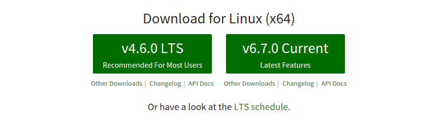

> #### warning::5. NodeJS
> ### ¿Qué es?   
Node es un intérprete Javascript del lado del servidor que cambia la noción de cómo debería trabajar un servidor. Su meta es permitir a un programador construir aplicaciones altamente escalables y escribir código que maneje decenas de miles de conexiones simultáneas en una sólo una máquina física.

> ### Instalación
> Para instalar ***NodeJS*** se ha accedido a la [página oficial de nodeJS](https://nodejs.org/en/)
> donde se ha encontrado dos versiones, una estable y la ultima version reciente.Se instaló la versión estable.
