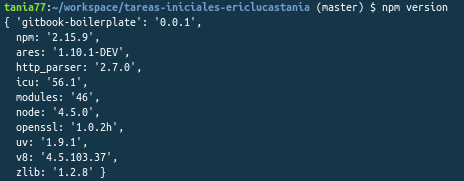

> #### warning:: NPM
> Es el manejdor por defecto para Node.js, un entorno de ejecucion para JavaScript. Se ejecuta desde la linea de comandos y maneja las dependencias para una aplicación, es el equivalente a gemspec de ruby.
Ademas permite a los usuarios instalar aplicaciones Node.js que se encuentran en el repositorio. La sintaxis para instalar un modulo es:

> ```$ npm install <Module Name> ```


> ## Comprobación de **npm**

> Para comprobar el que npm se ha instalado correctamente hemos ejecutado el comando : ```npm version```. Tras la correcta ejecución del mismo damos por adecuada la intrepretación de comandos en el mismo.

> 
